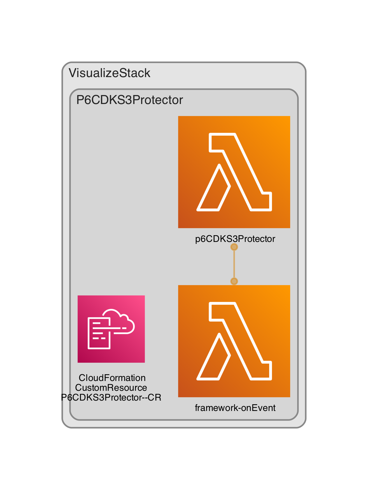

AWS CDK: A real-time S3 Protector

# P6CDKS3Protector

## LICENSE

[](https://opensource.org/licenses/Apache-2.0)

## Other

  

## Usage

```ts
...
import { P6CDKS3Protector } from 'p6-cdk-s3-protector'

new P6CDKS3Protector(this, 'p6CDKS3Protector')
```

## Architecture



## Author

Philip M. Gollucci <pgollucci@p6m7g8.com>
